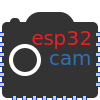

# esp32cam: OV2640 camera on ESP32-CAM

 

**esp32cam** library provides an object oriented API to use OV2640 camera on ESP32 microcontroller.
It is a wrapper of [esp32-camera library](https://github.com/espressif/esp32-camera).
This library has been tested with AI Thinker [ESP32-CAM](http://www.ai-thinker.com/pro_view-24.html) board and OV2640 camera.

* [Doxygen documentation](https://esp32cam.yoursunny.dev)
* [#esp32cam on Twitter](https://twitter.com/hashtag/esp32cam)
* [video tutorial](https://youtu.be/Sb08leLWOgA)

## Installation

1. Clone this repository under `$HOME/Arduino/libraries` directory.
2. Add `#include <esp32cam.h>` to your sketch.
3. In *Tools* - *Board* menu, select **AI Thinker ESP32-CAM** to enable 4MB external PSRAM.
4. Check out the [examples](examples/) for how to use.
