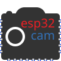

# esp32cam: ESP32 Camera for Arduino IDE

 

**esp32cam** library provides an object oriented API to use OV2640 camera on ESP32 microcontroller.
It is a wrapper of the [Espressif ESP32 camera driver](https://github.com/espressif/esp32-camera).

* [Doxygen documentation](https://esp32cam.yoursunny.dev)
* [#esp32cam on Twitter](https://twitter.com/hashtag/esp32cam)
* [video tutorial](https://youtu.be/Sb08leLWOgA)

## Tested Hardware

This library has been tested with these microcontroller boards:

* AI Thinker [ESP32-CAM](https://vdoc.ai-thinker.com/en/esp32-cam)
* Seeed Studio [XIAO ESP32-S3 Sense](https://wiki.seeedstudio.com/xiao_esp32s3_getting_started/)
* unbranded [ESP32-S3-CAM](https://community.home-assistant.io/t/esp32-s3-cam-dev-board-on-aliexpress/731795/21) with ESP32-S3-N16R8 chip

[`pins.hpp`](src/esp32cam/pins.hpp) lists several other boards contributed by users.

This library has been tested with OV2640 and OV3660 camera sensors.
It is likely compatible with other camera sensors supported by the driver.

## Installation

1. Install [ESP32 Arduino core](https://github.com/espressif/arduino-esp32) v3.x.
2. Clone this repository under `$HOME/Arduino/libraries` directory.
3. Select your board and enable external PSRAM.
4. Add `#include <esp32cam.h>` to your sketch.
5. Check out the [examples](examples/) for how to use.
